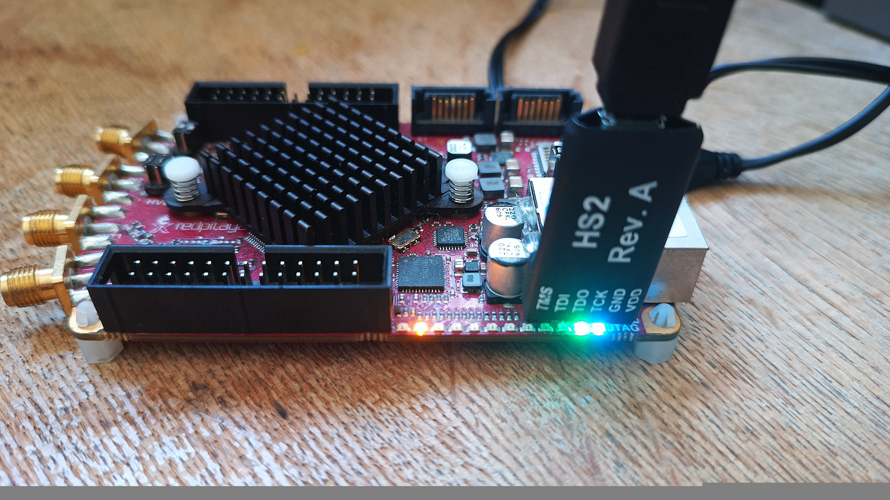
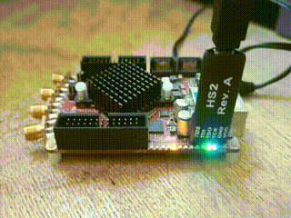

With the proposed tools
```
make
make load
```
or with Gwenhael's OpenXC7 tools:
```
source /opt/openxc7/export.sh
make
openFPGALoader -c digilent_hs2 encaps_TP1.bit  # make load
```

Tested as functional with Yosys 0.46+124 (git sha1 8c2d1a16d, g++ 12.2.0-14 -fPIC -O3) and 
nextpnr-xilinx (Version 8f178fc6), or (OpenXC7): Yosys 0.44 and nextpnr-xilinx Version 0.8.2.


Tested as *failing* with Yosys 0.51 (git sha1 c4b5190229616f7ebf8197f43990b4429de3e420) and
nextpnr-xilinx (Version 8f178fc6)




